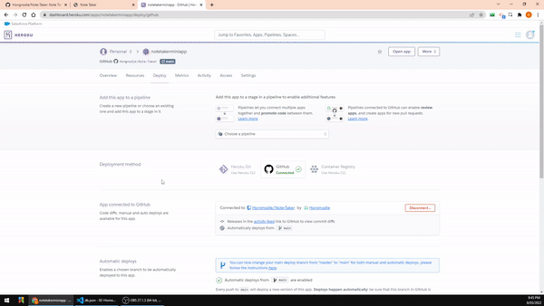

# Note Taker  

  ## Deployed with Heroku at:

  [Open web paged powered by Heroku Here](https://notetakerminiapp.herokuapp.com/)

  [See video instruction here](https://drive.google.com/file/d/1suLqFV8Ca_JDkFyyVvc3xpLw3jEX_YWC/view)

  ## Description

  Note Taker can be used to write and save notes. This application will use an Express.js back end and will save and retrieve note data from a JSON file.

  ## Table of Contents

  * [Installation](#installation)
  * [Usage](#usage)
  * [License](#license)
  * [Contributing](#contributing)
  * [Questions](#questions)

  ***

  ## Installation

  If you would prefer to run this page on your local machine simply clone the repo and run the command `npm i` in your terminal. This will download all the dependencies you need to run the project. 

  ## Usage

  

  
User Story

  AS A small business owner  
  I WANT to be able to write and save notes  
  SO THAT I can organize my thoughts and keep track of tasks I need to complete  
  
  

  

  
Acceptance Criteria

   
  GIVEN a note-taking application  
  WHEN I open the Note Taker  
  THEN I am presented with a landing page with a link to a notes page  
  WHEN I click on the link to the notes page  
  THEN I am presented with a page with existing notes listed in the left-hand column, plus empty fields to enter a new note title and the note’s text in the   right-hand column  
  WHEN I enter a new note title and the note’s text  
  THEN a Save icon appears in the navigation at the top of the page  
  WHEN I click on the Save icon  
  THEN the new note I have entered is saved and appears in the left-hand column with the other existing notes  
  WHEN I click on an existing note in the list in the left-hand column  
  THEN that note appears in the right-hand column  
  WHEN I click on the Write icon in the navigation at the top of the page  
  THEN I am presented with empty fields to enter a new note title and the note’s text in the right-hand column  
  

  

  
Getting Started

  On the back end, the application should include a `db.json` file that will be used to store and retrieve notes using the `fs` module.  
  The following HTML routes should be created:  
  * `GET /notes` should return the `notes.html` file.  
  * `GET *` should return the `index.html` file.  
  The following API routes should be created:  
  * `GET /api/notes` should read the `db.json` file and return all saved notes as JSON.  
  * `POST /api/notes` should receive a new note to save on the request body, add it to the `db.json` file, and then return the new note to the client. You'll need to find a way to give each note a unique id when it's saved (look into npm packages that could do this for you).  
  

  ## Screenshot of the Application

  

  [See code package at Github](https://github.com/Hongnodie/Note-Taker.git)
  
  ## License
  

  
  
MIT License

  
  > Copyright (c) [2022] [Hongnodie]
  > 
  > __Permission is hereby granted, free of charge, to any person obtaining a copy__
  > __of this software and associated documentation files (the "Software"), to deal__
  > __in the Software without restriction, including without limitation the rights__
  > __to use, copy, modify, merge, publish, distribute, sublicense, and/or sell__
  > __copies of the Software, and to permit persons to whom the Software is__
  > __furnished to do so, subject to the following conditions:__
  > 
  > The above copyright notice and this permission notice shall be included in all
  > copies or substantial portions of the Software.
  > 
  > THE SOFTWARE IS PROVIDED "AS IS", WITHOUT WARRANTY OF ANY KIND, EXPRESS OR
  > IMPLIED, INCLUDING BUT NOT LIMITED TO THE WARRANTIES OF MERCHANTABILITY,
  > FITNESS FOR A PARTICULAR PURPOSE AND NONINFRINGEMENT. IN NO EVENT SHALL THE
  > AUTHORS OR COPYRIGHT HOLDERS BE LIABLE FOR ANY CLAIM, DAMAGES OR OTHER
  > LIABILITY, WHETHER IN AN ACTION OF CONTRACT, TORT OR OTHERWISE, ARISING FROM,
  > OUT OF OR IN CONNECTION WITH THE SOFTWARE OR THE USE OR OTHER DEALINGS IN THE
  > SOFTWARE.
    
  

    

  ## Contributing

  Fork this repo and make it your own! Feel free to submit pull requests for any changes that you think should be added to the final app. 
  
  ## Questions?

  If you have any questions about the project you can reach out to me via email or GitHub with the information below. 

  >Email: Hongnodie@gmail.com 

  >GitHub : [Hongnodie](https://github.com/Hongnodie)